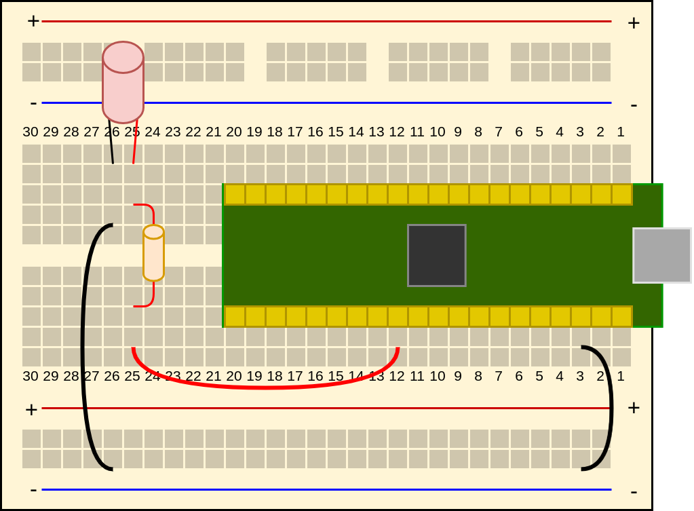

# Pico External LED Project in C
This is an introductory embedded programming project utilizing a Raspberry Pi Pico microcontroller and C to make an LED blink.

## Materials List
- Pico
- Breadboard
- LED
- Resister
- Hookup wire

## Board Layout

